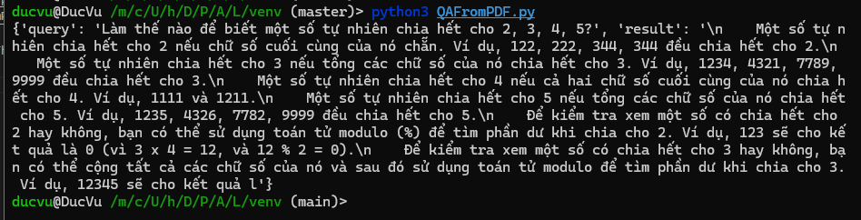

# Implement LangChain to read file PDF and answer question in Vietnamese
## Source
* Model: From huggingface.co, [click here to download model](https://huggingface.co/vilm/vinallama-7b-chat-GGUF)
* Convert file pdf to vector database: [Pre-processing data](/venv/prepare_vector_db.py)
* File train bot in the specified context: [QAFromPDF.py](/venv/QAFromPDF.py)
* PDF to test: [PDFs](/data/)
* Source: [From Mi AI](https://www.youtube.com/watch?v=z1OfI_NOvgI). Thank!
## Install tools
```
pip install -r venv/setup.txt
```
## Run
* Pre-processing data
```
cd venv/
python3 prepare_vector_db.py
```
* Train model
```
python3 QAFromPDF.py
```
# Result 
* Question: "Làm thế nào để biết một số tự nhiên chia hết cho 2, 3, 4, 5?"
* Response:  Một số tự nhiên chia hết cho 2 nếu chữ số cuối cùng của nó chẵn. Ví dụ, 122, 222, 344, 344 đều chia hết cho 2. Một số tự nhiên chia hết cho 3 nếu tổng các chữ số của nó chia hết cho 3. Ví dụ, 1234, 4321, 7789, 9999 đều chia hết cho 3. Một số tự nhiên chia hết cho 4 nếu cả hai chữ số cuối cùng của nó chia hết cho 4. Ví dụ, 1111 và 1211. Một số tự nhiên chia hết cho 5 nếu tổng các chữ số của nó chia hết cho 5. Ví dụ, 1235, 4326, 7782, 9999 đều chia hết cho 5. Để kiểm tra xem một số có chia hết cho 2 hay không, bạn có thể sử dụng toán tử modulo (%) để tìm phần dư khi chia cho 2. Ví dụ, 123 sẽ cho kết quả là 0 (vì 3 x 4 = 12, và 12 % 2 = 0). Để kiểm tra xem một số có chia hết cho 3 hay không, bạn có thể cộng tất cả các chữ số của nó và sau đó sử dụng toán tử modulo để tìm phần dư khi chia cho 3. Ví dụ, 12345 sẽ cho kết quả l' \
    